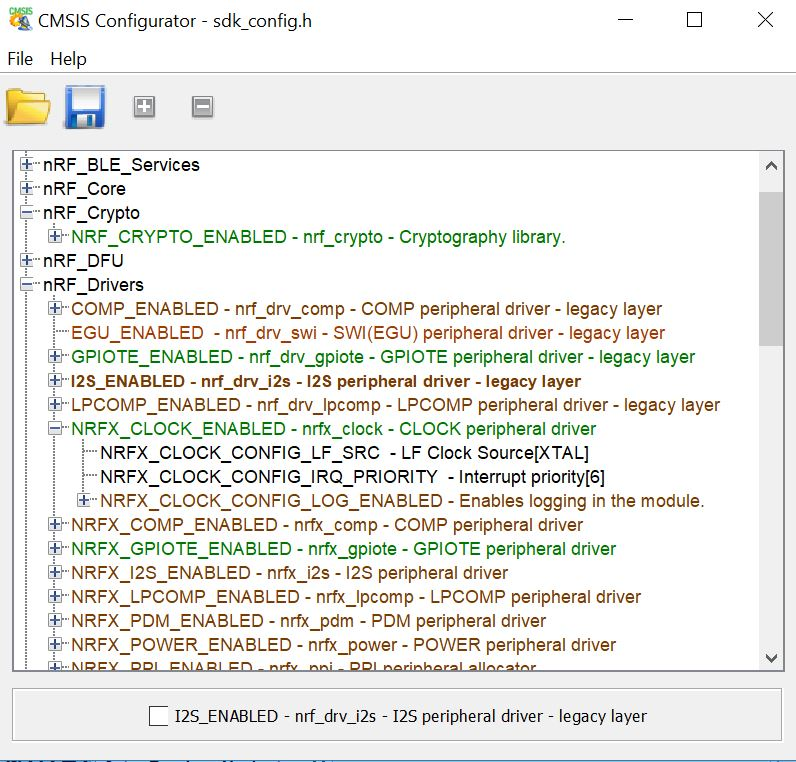

# CMSIS Configuration Wizard with Color
This is a java app that visually edits/displays some CMSIS headers. 
This code came from SourceForge, and there it seems to have an Eclipse Public License.

See https://sourceforge.net/projects/cmsisconfig/

CMSIS Configuration Wizard is the name and I've left that with the build to make it simple to replace one with the other. I'm not wedded to doing that.

Anyway, this is mainly the original code with colors showing checkbox values so you don't have to scroll through to find out what's on and what's off. If I do much more work I'll do it in a different language but at least it's more useful.

|Color|Type|Description|
|----|--|--|
|Black|Various|Non-checkable options|
|Dark Red|Folders|Checked off|
|Dark Green|Folders|Checked on|
|Light Red|Choice|Checked off|
|Light Green|Choice|Checked on|

