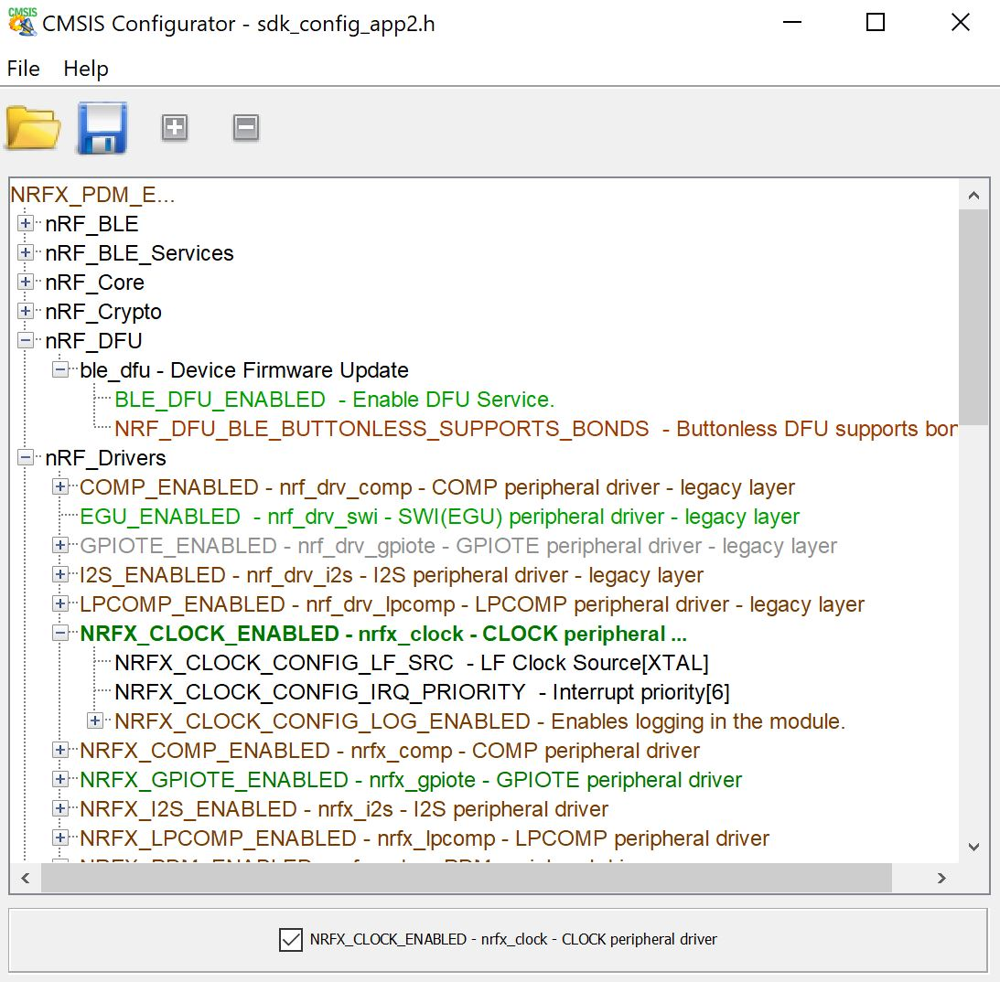

# CMSIS Configuration Wizard with Color
This is a java app that visually edits/displays some CMSIS headers. Used by me with Segger Studio builds based on the Nordic nrf5 SDK since the sdk_config.h file is so complex and vital.

This code came from SourceForge, and there it seems to have an Eclipse Public License. See https://sourceforge.net/projects/cmsisconfig/

CMSIS Configuration Wizard was the name and I've left that with the build to make it simple to replace one with the other. I'm not wedded to doing that.

## <b>Usage</b>
The .jar file in the dist folder is usable standalone as in

 `java -jar dist/CMSIS_Configuration_Wizard.jar`

## <b>Additions</b>

### <b>Color</b>
Colors show checkbox values so I can see at a glance what's on and what's off.

|Color|Type|Description|
|----|--|--|
|Black|Various|Non-checkable options|
|Dark Red|Folders|Checked off|
|Dark Green|Folders|Checked on|
|Light Red|Choice|Checked off|
|Light Green|Choice|Checked on|
|Gray|Various|Literally Undefined - see below|

### <b>Values in brackets</b>
Fields which have values associated with them now show the value [in brackets] after the text.

### <b>Undefinition as Gray</b>
The nrf5 SDK has this bad habit of using #ifdef instead of #if for legacy stuff so to turn it off you have to comment it out or remove it. Removing it is bad because there's no record.

So, if the entry exists but the #define value line is commented out or missing then the entry is drawn in gray to show that it's legacy-turned-off. Don't edit the bogus value.

### <b>Resizing</b>
The tree now expands to fill the form when you resize the window.

